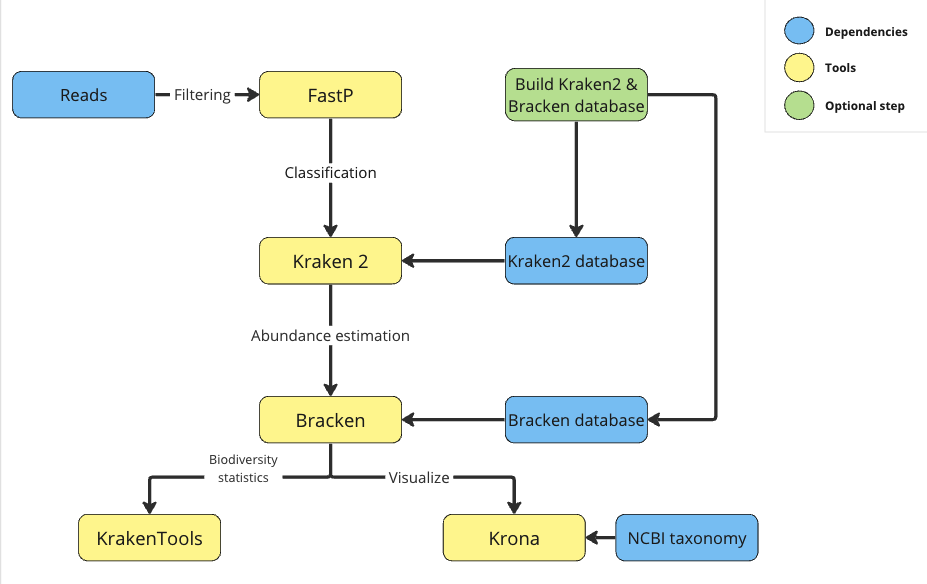

> Metagenomic Analysis UniSeqs (MAUS)


This pipeline is for the analysis of metagenomic Illumina sequencing.


## Pipeline overview



## Installation

It's encouraged to use a conda/mamba enviroment.

For Linux:

```
mamba create -n MAUS -c bioconda fastp kraken2 bracken krona fastqc tqdm
mamba activate MAUS
pip install multiqc
git clone https://github.com/juanjo255/MAUS.git
cd MAUS
```

You need to replace the ```ktUpdateTaxonomy``` in your conda/mamba path for our modified version
and add ```kraken2_build folder``` to your path and make sure it has execution permission.
```
cp ktUpdateTaxonomy.sh $(which ktUpdateTaxonomy.sh)
export PATH=$PATH:$(pwd)/kraken2_build
chmod +x kraken2_build/*
```

NOTES:
* The folder ```Kraken2_build```is required to be in the path 
* MultiQC is installed with pip because it works better than conda both in Linux and MacOS

## Usage intructions

* If for any reason you got problems during taxonomy and libraries downloading, you can resume the download in this way:

  ```
  k2 download-taxonomy --db path/to/database
  k2 download-library --db path/to/database --library "bacteria, fungi"
  ```
  Finally, build the database with:
  ```
  kraken2-build --build --threads 14 --db path/to/database
  ```

* For help message
  ```
  ./MAUS_cli.sh -h
  ```
  
  ```
    Options:
    Required:

        -1        Input R1 paired end file. [required].
        -2        Input R2 paired end file. [required].
        -d        Database for Kraken2 and Bracken. if you do not have one, you need to create it first. Check flag -n and -g. [required].

    
    Optional:

        -r        Deactivate fastQC. Adding this option will deactivate quality assessment with fastqc. [False] 
        -n        Build kraken2 and Bracken database. Adding this option will activate database construction (Use with -g for library download). [False].
        -g        Libraries. It can accept a comma-delimited list with: archaea, bacteria, plasmid, viral, human, fungi, plant, protozoa, nr, nt, UniVec, UniVec_Core. [kraken2 standard].
        -t        Threads. [4].
        -w        Working directory. Path to create the folder which will contain all MAUS information. [./MAUS_result].
        -z        Different output directory. Create a different output directory every run (it uses the date and time). [False].
        -p        Deactivate FastP. Adding this option will deactivate FastP filtering [False]
        -f        FastP options. [\" \"].
        -l        Read length (Bracken). [100].
        -c        Classification level (Bracken) [options: D,P,C,O,F,G,S,S1,etc]. [F]
        -s        Threshold before abundance estimation (Bracken). [0].
        -k        kmer length. (Kraken2,Bracken).[35]
        *         Help.
  
  ```

## Quick usage

* If you already have a kracken2 and a Bracken database:
  
  ```
  ./MAUS_cli.sh -1 path/to/reads_R1.fastq[.gz] -2 path/to/reads_R2.fastq[.gz] -d path/to/database-t 14 
  ```


## Twitter/X

[@Juanpicon255](https://x.com/Juanpicon255)
