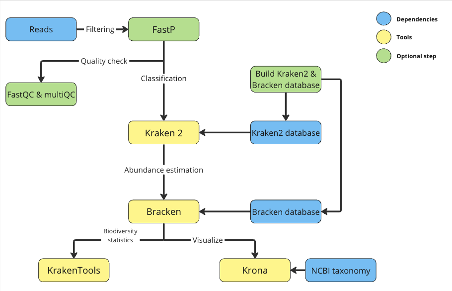

> Metagenomic Analysis UniSeqs (MAUS)

# Table of Contents
+ [About](#About)
+ [Pipeline Overview](#Pipeline-overview)
+ [Installation](#Installation)
+ [Usage](#Usage)
+ [Usage examples](#Usage-examples)

# About

  MAUS is a pipeline for the analysis of metagenomic Paired-end Illumina sequencing.

# Pipeline overview



# Installation

It's encouraged to use a conda/mamba enviroment.

For Linux:

```
mamba create -n MAUS -c bioconda fastp kraken2 bracken krona fastqc tqdm
mamba activate MAUS
pip install multiqc scipy
git clone --recursive https://github.com/juanjo255/MAUS.git
cd MAUS
```

**You need to replace the ```ktUpdateTaxonomy``` in your conda/mamba path for our modified version**, this modified version works with https protocol.
Also, please add ```kraken2_build``` to your path and make sure it has execution permission.
```
# Add to path
cp ktUpdateTaxonomy.sh $(which ktUpdateTaxonomy.sh)
export PATH=$PATH:$(pwd)/kraken2_build

# Execution permission
chmod +x kraken2_build/*
chmod +x *
```

**NOTES:**
* The folder ```Kraken2_build```is required to be in the path 
* MultiQC is installed with pip because it works better than conda both in Linux and MacOS

# Usage

* If for any reason you got problems during taxonomy and libraries downloading, you can resume the download in this way:

  ```
  k2 download-taxonomy --db path/to/database
  k2 download-library --db path/to/database --library "bacteria, fungi"
  ```
  Finally, build the database with:
  ```
  kraken2-build --build --threads 14 --db path/to/database
  ```

* For help message
  ```
  ./MAUS_cli.sh -h
  ```
  
  ```
  Usage:
    MAUS_cli.sh [options] -1 reads_R1.fastq -2 reads_R2.fastq
      or 
    MAUS_cli.sh [options] -3 path/to/dir/pairedReads

  Options:
    Required:

        -1        Input R1 paired end file. [required].
        -2        Input R2 paired end file. [required].
        -3        Directory with R1 and R2 files. [required].
        -d        Database for Kraken2 and Bracken. if you do not have one, you need to create it first. Check flag -n and -g. [required].

    
    Optional:

        -r        Deactivate fastQC. Adding this option will deactivate quality assessment with fastqc. [False] 
        -n        Build kraken2 and Bracken database. Adding this option will activate database construction (Use with -g or -e for library download). [False].
        -g        Libraries. It can accept a comma-delimited list with: archaea, bacteria, plasmid, viral, human, fungi, plant, protozoa, nr, nt, UniVec, UniVec_Core. [kraken2 standard].
        -e        Special library. One of: greengenes, silva, rdp.
        -t        Threads. [4].
        -w        Working directory. Path to create the folder which will contain all MAUS information. [./MAUS_result].
        -z        Different output directory. Create a different output directory every run (it uses the date and time). [False].
        -p        Deactivate FastP. Adding this option will deactivate FastP filtering [False]
        -f        FastP options. [\" \"].
        -l        Read length (Bracken). [100].
        -c        Classification level (Bracken) [options: D,P,C,O,F,G,S,S1,etc]. [F]
        -s        Threshold before abundance estimation (Bracken). [0].
        -k        kmer length. (Kraken2,Bracken).[35]
        *         Help.
  
  ```

# Usage examples

* If you already have a kracken2 and a Bracken database:
  
  ```
  ./MAUS_cli.sh -1 $R1_file -2 $R2_file  -d path/to/database -t 32 
  ```
* Otherwise it can be install with ```-n``` option.
    For example, for silva database:
    ```
    ./MAUS_cli.sh -n -e silva -d path/to/kraken2_silva_db -t 32 -1 $R1_file -2 $R2_file -w path/to/workingDir
    ```
*  If you have multiple paired-end reads you can give the directory where they are stored with ```-3```. It will look for all fastq files, It will assume that they are named the same** only different by the number before the dot referring to forward and reverse** E.g. readName_1.fastq and readName_2.fastq. All paired reads **must** follow this notation as the pipeline will look for the **_1.** and **_2.** part.
    ```
    ./MAUS_cli.sh -n -e silva -d path/to/kraken2_silva_db -t 32 -3 path/to/dir/pairedReads -w path/to/workingDir
    ```
    For each paired-end reads a folder with the results will be created using the prefix name.

* If you are going to use regex use doble quotes to avoid unexpect behaviors:
  ```
  MAUS_cli.sh -n -e silva -d path/to/kraken2_silva_db  -t 32 -3 "Proyecto_*/" -w ./maus_out/
  ```
  In the above case MAUS will look for all fastq files in folders that start with **Proyecto_**

## Twitter/X

[@Juanpicon255](https://x.com/Juanpicon255)
